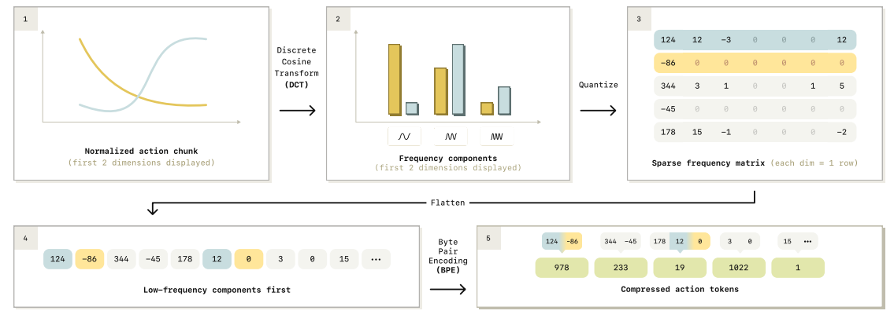
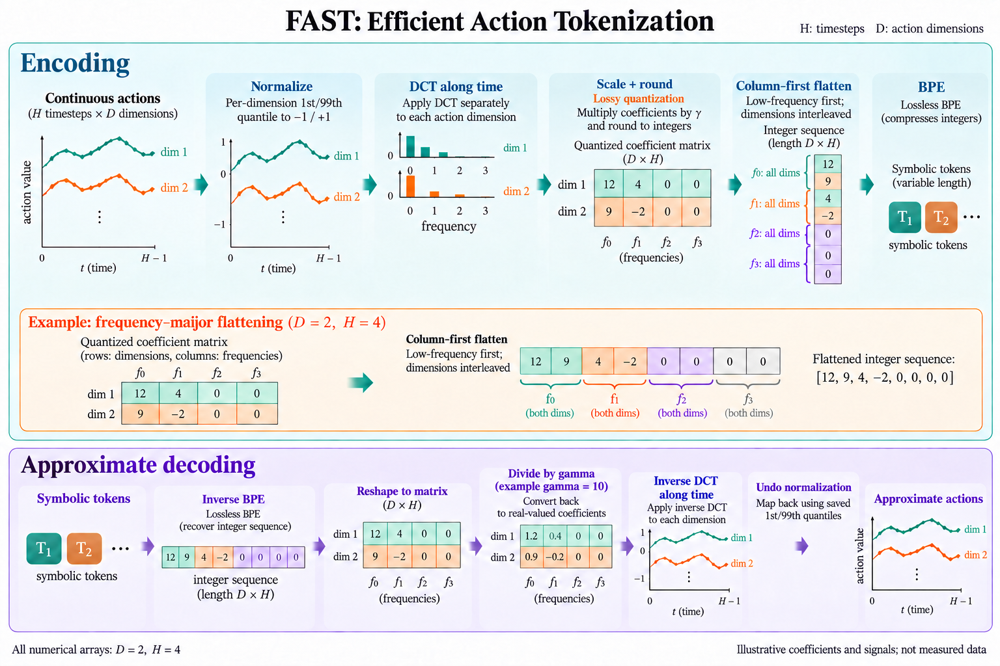
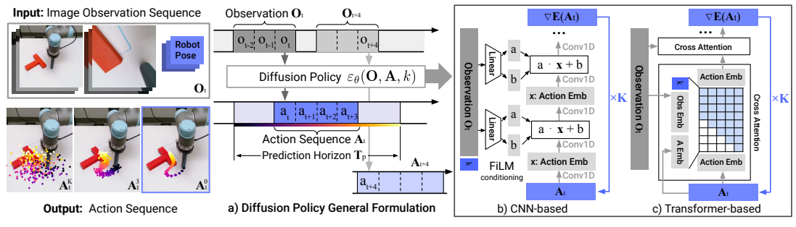
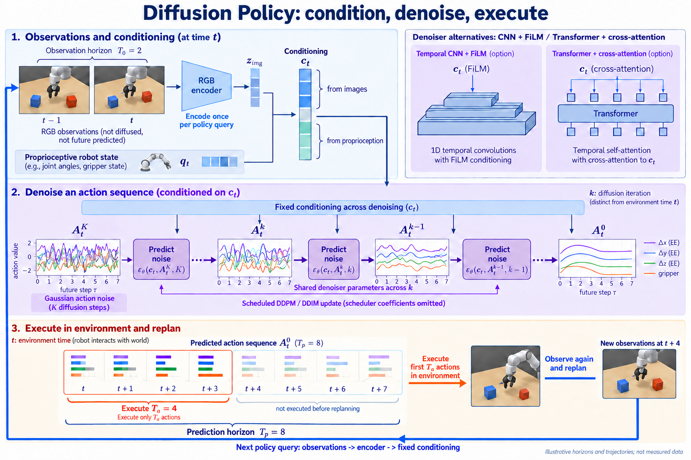
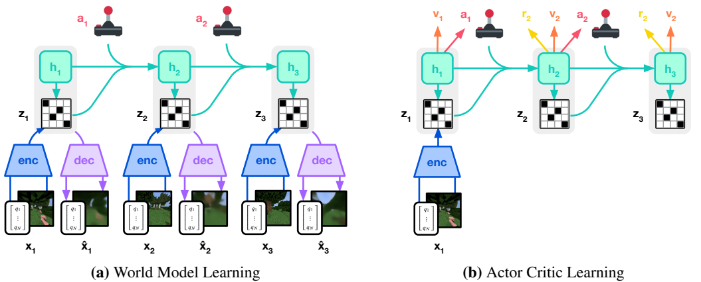
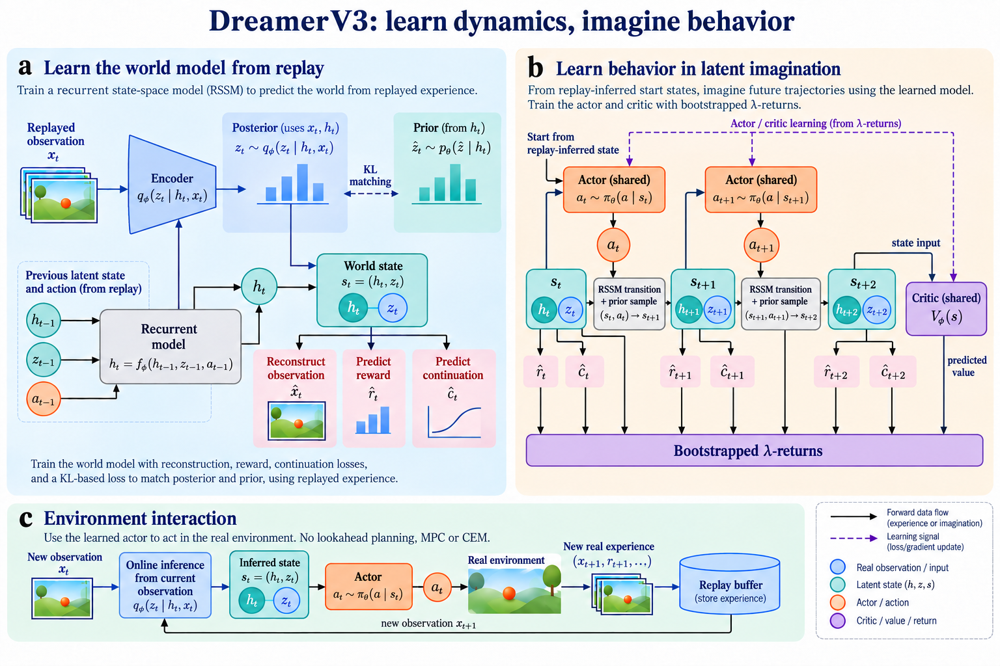

# FigureCompose：Zotero 三篇论文生图审阅

2026-10-03 本轮结果：FAST、Diffusion Policy、DreamerV3。每例一次生图、两轮修订，共九次内置 imagegen 调用。先按方法正文生成和修订，最后查看论文原图比较；目标原图未作为生成输入。

[下载完整 ZIP 审阅包](downloads/zotero-three-cases-2026-10-03.zip) · [完整评估报告](reviews/2026-10-03-zotero-three-cases/REPORT.md) · [审阅包目录](reviews/2026-10-03-zotero-three-cases) · [SHA-256](downloads/zotero-three-cases-2026-10-03.zip.sha256)

ZIP 解压后直接用浏览器打开 comparison.html，可切换初稿、第一修订和最后一稿。GitHub 的 HTML 文件页显示源码；下面可直接查看图像，点击图片文件可放大。

|案例|结论|逐项检查|
|---|---|---|
|FAST|数值一致性未通过：上方展开列仍缺一个零。|[评价](reviews/2026-10-03-zotero-three-cases/fast/evaluation.json)|
|Diffusion Policy|限定核心机制范围通过复核；省略 causal mask、逐层 FiLM 等内部细节。|[评价](reviews/2026-10-03-zotero-three-cases/diffusion-policy/evaluation.json)|
|DreamerV3|科学关系未通过：prior 条件线和在线反馈仍存在问题。|[评价](reviews/2026-10-03-zotero-three-cases/dreamerv3/evaluation.json)|

本轮是 Stage 1 PNG 测试，没有新的 SVG；不是三个成功案例，也没有投稿级验收。生成与评价由同一 Codex 完成，不是独立盲测。原图比生成图普遍更紧凑；生成图解释更多，也更容易出现精确数字和复杂连线错误。

## FAST

来源：[FAST，2501.09747v1](https://arxiv.org/abs/2501.09747v1)，Figure 4，PDF 第 5 页。作者 Karl Pertsch、Kyle Stachowicz 等。原图为论文作者作品，仅作对照审阅。

|论文原图|最后一稿，数值一致性未通过|
|---|---|
|||

[初稿](reviews/2026-10-03-zotero-three-cases/fast/draft-1.png) · [第一修订](reviews/2026-10-03-zotero-three-cases/fast/draft-2.png) · [生图提示词](reviews/2026-10-03-zotero-three-cases/fast/generation-prompt.txt) · [两轮修订提示词](reviews/2026-10-03-zotero-three-cases/fast)

## Diffusion Policy

来源：[Diffusion Policy，2303.04137v5](https://arxiv.org/abs/2303.04137v5)，Figure 2，PDF 第 3 页，2024 扩展版。作者 Cheng Chi 等。

|论文原图|最后一稿，限定核心机制范围已复核|
|---|---|
|||

[初稿](reviews/2026-10-03-zotero-three-cases/diffusion-policy/draft-1.png) · [第一修订](reviews/2026-10-03-zotero-three-cases/diffusion-policy/draft-2.png) · [生图提示词](reviews/2026-10-03-zotero-three-cases/diffusion-policy/generation-prompt.txt) · [两轮修订提示词](reviews/2026-10-03-zotero-three-cases/diffusion-policy)

## DreamerV3

来源：[Mastering Diverse Domains through World Models，2301.04104v2](https://arxiv.org/abs/2301.04104v2)，Figure 3，PDF 第 3 页。作者 Danijar Hafner、Jurgis Pasukonis、Jimmy Ba、Timothy Lillicrap。

|论文原图|最后一稿，科学关系未通过|
|---|---|
|||

[初稿](reviews/2026-10-03-zotero-three-cases/dreamerv3/draft-1.png) · [第一修订](reviews/2026-10-03-zotero-three-cases/dreamerv3/draft-2.png) · [生图提示词](reviews/2026-10-03-zotero-three-cases/dreamerv3/generation-prompt.txt) · [两轮修订提示词](reviews/2026-10-03-zotero-three-cases/dreamerv3)

## 审阅范围

PNG、提示词和科学 brief 保持原字节。审阅包元数据使用公开论文链接，保留附件 key、PDF 哈希、稿次记录和文件清单。本机绝对路径已移除；未上传论文全文、整页渲染或整个 Zotero 库。

[导出说明](reviews/2026-10-03-zotero-three-cases/EXPORT-NOTES.md) · [逐文件哈希清单](reviews/2026-10-03-zotero-three-cases/EXPORT-MANIFEST.json) · [当前 Stage 1 约定](reviews/2026-10-03-zotero-three-cases/workflow/STAGE1-FREEZE.md) · [Stage 2 约定，仅作上下文](reviews/2026-10-03-zotero-three-cases/workflow/STAGE2-CONTRACT.md)
