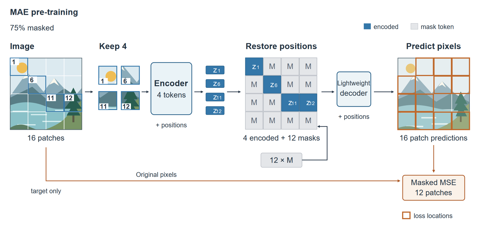
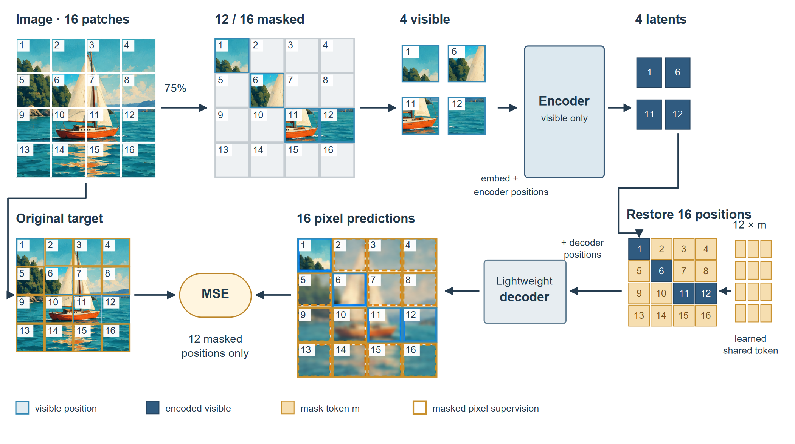
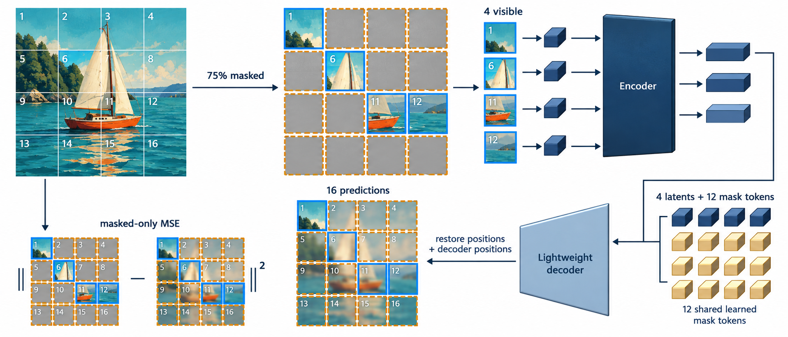
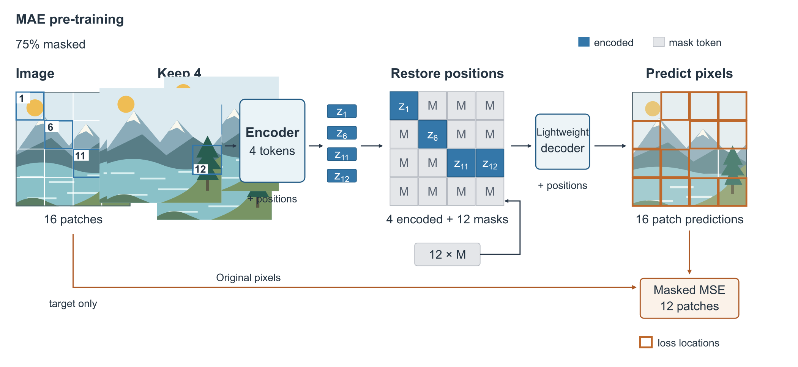
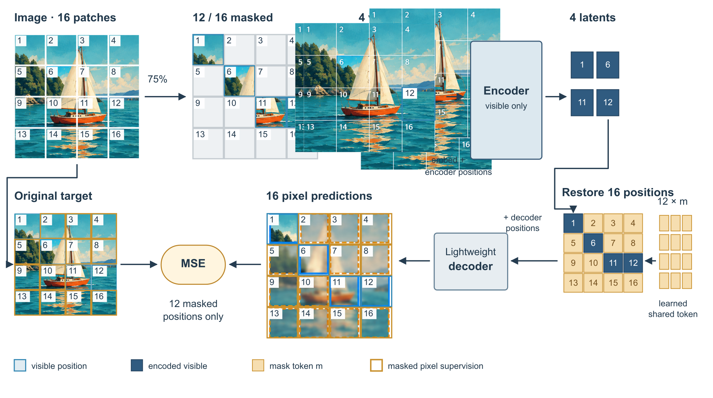

# FigureCompose：2026-10-05 人工复核包

本包包含最近的 reset validation 实验、Diffusion Policy Stage 2 成品与过程证据、当前工作记录，以及实验结束后的再次复核意见。两张 MAE 候选均为 REVISE；原始生成 PNG 科学 FAIL。历史 canary 的同 Codex ACCEPTED 记录保留，不代表用户确认或发表认证。

[完整 ZIP](../../downloads/figurecompose-reset-review-2026-10-05.zip) · [实验报告](FigureCompose/outputs/reset-validation-2026-10-05/RESULTS.md) · [再次复核](FOLLOWUP-REVIEW.md) · [实验预注册](FigureCompose/outputs/reset-validation-2026-10-05/PROTOCOL.md) · [独立子代理审阅](FigureCompose/outputs/reset-validation-2026-10-05/final-review/REVIEW.md) · [导出说明](EXPORT-NOTES.md) · [逐文件哈希](EXPORT-MANIFEST.json)

## 建议复核顺序

先只看下面两张候选图与各自 caption，尝试解释 encoder 输入、mask token 插入位置、位置恢复和 loss 范围，记录哪里需要猜测。然后查看原始生成 PNG、50% 修改和 Inkscape 导出，最后读科学输入、评估报告与论文原图。这个顺序用于减少 PASS 标签对人工判断的影响，不是强制要求。

|V：直接 SVG，REVISE|R：imagegen→SVG，REVISE|
|---|---|
|||
|[SVG](FigureCompose/outputs/reset-validation-2026-10-05/arm-vector/final.svg) · [caption](FigureCompose/outputs/reset-validation-2026-10-05/arm-vector/caption.md) · [50% 副本](FigureCompose/outputs/reset-validation-2026-10-05/arm-vector/edit/preview-178mm.png)|[SVG](FigureCompose/outputs/reset-validation-2026-10-05/arm-raster/final.svg) · [caption](FigureCompose/outputs/reset-validation-2026-10-05/arm-raster/caption.md) · [50% 副本](FigureCompose/outputs/reset-validation-2026-10-05/arm-raster/semantic-edit-50percent-preview.png)|

## 必须保留的失败证据

R 原始生成 PNG 只有三个 encoder 输出块，却有四个可见输入和四潜变量标注；恢复位置及目标像素示意也存在问题。后续 SVG 修复不能把该 PNG 改判为通过。

Inkscape 1.4.4 成功解析两张 SVG，却把局部裁片渲染成重叠的完整场景。直接导出与另存导出分别具有相同 PNG 哈希。文字数量保留不代表视觉兼容。

|V：Inkscape 失败导出|R：Inkscape 失败导出|
|---|---|
|||

[原生导出检查](FigureCompose/outputs/reset-validation-2026-10-05/final-review/native-editor/check.json) · [R 生图 prompt](FigureCompose/outputs/reset-validation-2026-10-05/arm-raster/generation-prompt.txt) · [V 全部草稿/记录](FigureCompose/outputs/reset-validation-2026-10-05/arm-vector) · [R 全部草稿/记录](FigureCompose/outputs/reset-validation-2026-10-05/arm-raster)

## Diffusion Policy 与工作记录

[Stage 2 全部产物/过程](FigureCompose/outputs/diffusion-policy-stage2) · [178 mm 成品](FigureCompose/outputs/diffusion-policy-stage2/preview-178mm.png) · [历史验收](FigureCompose/outputs/diffusion-policy-stage2/acceptance.md) · [本轮复审](FigureCompose/outputs/reset-validation-2026-10-05/existing-review/REVIEW.md) · [Ta=3 编辑副本](FigureCompose/outputs/reset-validation-2026-10-05/existing-review/edit/preview-178mm.png)

[进度快照](FigureCompose/PROGRESS.md) · [路线历史](FigureCompose/HISTORY.md) · [独立 Stage 1 审阅原件](FigureCompose/docs/sources/stage1-independent-review-2026-10-03.original.txt) · [尺寸要求原文](FigureCompose/docs/sources/diffusion-policy-width-confirmation-2026-10-04.md)

## 人工复核重点

1. 去掉对 MAE 的先验知识后，图与 caption 是否足以恢复机制，哪里会误读？
2. 图像裁片是否真正解释科学操作？哪些重复状态、编号和标签可以省略？
3. 两图是否达到论文 figure 的视觉水准，还是仍偏教学示意？R 的插画收益是否值得完整 PNG→SVG 路线？
4. 50% 修改是否保持图形质量，尤其 R 的裁片比例和两图的文字尺寸？
5. 178 mm 实际尺寸下，5–6 pt 小字、监督分支和折返路径是否可读？
6. 对照原图后，是否存在未记录的非必要构图相似性？该问题与科学必需的 encoder→decoder 顺序分开判断。

参考对照：[DB005](reference-audit/DB005.png)、[DB082](reference-audit/DB082.png)、[MAE Figure 1](FigureCompose/outputs/reset-validation-2026-10-05/coordinator-post-freeze-target.png)。参考来源与哈希见 [source-and-exposure](FigureCompose/outputs/reset-validation-2026-10-05/source-and-exposure.json)。论文和参考图版权归原作者，供本次归属明确的复核，不主张通用重用许可。作者只收到抽象原则，原图在主图冻结后用于审计。

没有人类读者研究、纸面打样、GUI 编辑或不同模型复现。作者阶段约 10–13 分钟，不代表完整交付时间。资料目录包含本地历史快照，其中部分旧案例链接指向包外历史上下文；本 README 的核心审阅入口均在包内。[此前三案例审阅包](../2026-10-03-zotero-three-cases/README.md)仍然保留。
